# ODH Release Process Workflow Diagram

This page contains the visual workflow diagram for the complete ODH release process. The diagram is designed to be embedded in guides and documentation to help users understand the flow.

## Complete Release Process

```mermaid
graph TD
    %% Styling
    classDef componentTeam fill:#e3f2fd,stroke:#1976d2,stroke-width:2px,color:#000000
    classDef releaseManager fill:#f3e5f5,stroke:#7b1fa2,stroke-width:2px,color:#000000
    classDef validationTeam fill:#e8f5e8,stroke:#388e3c,stroke-width:2px,color:#000000
    classDef automated fill:#fff8e1,stroke:#f57c00,stroke-width:2px,color:#000000
    classDef external fill:#fce4ec,stroke:#c2185b,stroke-width:2px,color:#000000
    classDef decision fill:#ffebee,stroke:#d32f2f,stroke-width:2px,color:#000000
    classDef status fill:#f5f5f5,stroke:#616161,stroke-width:2px,color:#000000

    %% Start and Setup
    START([Release Cycle Starts]) --> SETUP{Next Release<br/>Configured?}
    SETUP -->|No| NEXT[Set Next Release<br/>set-next-release.yaml]:::automated
    SETUP -->|Yes| READY
    NEXT --> READY[Release Status:<br/>scheduled]:::status

    %% Component Registration Phase
    READY --> REG[Component Registration<br/>Phase]:::status
    REG --> COMP1[Component Team 1<br/>register-component.yaml]:::componentTeam
    REG --> COMP2[Component Team 2<br/>register-component.yaml]:::componentTeam
    REG --> COMP3[Component Team N<br/>register-component.yaml]:::componentTeam

    %% Registration Process Details
    COMP1 --> VAL1{Registration<br/>Valid?}:::decision
    COMP2 --> VAL2{Registration<br/>Valid?}:::decision  
    COMP3 --> VAL3{Registration<br/>Valid?}:::decision

    VAL1 -->|Yes| STORE1[Store in releases/<version>/<br/>components.yaml]:::automated
    VAL2 -->|Yes| STORE2[Store in releases/<version>/<br/>components.yaml]:::automated
    VAL3 -->|Yes| STORE3[Store in releases/<version>/<br/>components.yaml]:::automated

    VAL1 -->|No| ERROR1[Registration Error<br/>Fix and Retry]:::componentTeam
    VAL2 -->|No| ERROR2[Registration Error<br/>Fix and Retry]:::componentTeam
    VAL3 -->|No| ERROR3[Registration Error<br/>Fix and Retry]:::componentTeam

    ERROR1 --> COMP1
    ERROR2 --> COMP2
    ERROR3 --> COMP3

    STORE1 --> CHECK
    STORE2 --> CHECK
    STORE3 --> CHECK[Release Readiness<br/>Check]:::releaseManager

    %% Release Triggering Phase
    CHECK --> READY_CHECK{80% Components<br/>Registered?}:::decision
    READY_CHECK -->|No| WAIT[Wait for More<br/>Registrations]:::releaseManager
    READY_CHECK -->|Yes| TRIGGER[Trigger Release<br/>trigger-release.yaml]:::releaseManager

    WAIT --> CHECK

    %% External Staging Phase
    TRIGGER --> IDEMPOTENT{Already<br/>Triggered?}:::decision
    IDEMPOTENT -->|Yes| SKIP[Skip - Maintain<br/>Idempotency]:::automated
    IDEMPOTENT -->|No| MAPPING[Build Component<br/>Mapping + Display Names]:::automated

    MAPPING --> EXTERNAL[Trigger External<br/>release-staging.yaml]:::external
    EXTERNAL --> PENDING[Release Status:<br/>awaiting_validation]:::status

    SKIP --> PENDING

    %% External Staging Monitoring
    PENDING --> MONITOR[Monitor External<br/>Workflow Progress]:::releaseManager
    MONITOR --> EXT_STATUS{External<br/>Staging OK?}:::decision
    EXT_STATUS -->|Failed| EXT_FAIL[Debug External<br/>Staging Issues]:::releaseManager
    EXT_STATUS -->|Success| Validation_READY[Ready for<br/>VALIDATION_APPROVAL]:::status

    EXT_FAIL --> EXT_RETRY{Retry<br/>Release?}:::decision
    EXT_RETRY -->|Yes| TRIGGER
    EXT_RETRY -->|No| FAIL_STATUS[Release Status:<br/>failed]:::status

    %% VALIDATION_APPROVAL Phase
    Validation_READY --> Validation_VALIDATE[Validation Validation<br/>Process]:::validationTeam
    Validation_VALIDATE --> Validation_CHECK{Quality<br/>Acceptable?}:::decision
    Validation_CHECK -->|No| Validation_ISSUES[Document Issues<br/>& Coordinate Fixes]:::validationTeam
    Validation_CHECK -->|Yes| Validation_SIGNOFF[VALIDATION_APPROVAL<br/>validate-release.yaml]:::validationTeam

    Validation_ISSUES --> Validation_RETRY{Retry After<br/>Fixes?}:::decision
    Validation_RETRY -->|Yes| Validation_VALIDATE
    Validation_RETRY -->|No| FAIL_STATUS

    %% Community Release Phase
    Validation_SIGNOFF --> RECORD[Record VALIDATION_APPROVAL<br/>& Timestamp]:::automated
    RECORD --> IN_PROGRESS[Release Status:<br/>in_progress_community_release]:::status
    IN_PROGRESS --> COMMUNITY[Trigger Community<br/>Release]:::automated
    COMMUNITY --> COMM_EXT[External: release-community.yaml<br/>in opendatahub-operator]:::external

    COMM_EXT --> PR_CREATE[Create Community<br/>Operators PR]:::external
    PR_CREATE --> PR_MONITOR[Monitor PR<br/>Creation & Review]:::automated

    PR_MONITOR --> PR_STATUS{PR Created<br/>& Merged?}:::decision
    PR_STATUS -->|Failed/Timeout| COMM_FAIL[Community Release<br/>Failed - Manual Completion Needed]:::status
    PR_STATUS -->|Success| COMPLETED[Release Status:<br/>completed]:::status

    COMM_FAIL --> MANUAL[Manual Community<br/>Release Process]:::releaseManager

    %% Completion Phase
    COMPLETED --> HISTORY[Move to Release<br/>History]:::automated
    HISTORY --> PROMOTE{Next Release<br/>Available?}:::decision
    PROMOTE -->|Yes| NEW_CURRENT[Promote Next to<br/>Current Release]:::automated
    PROMOTE -->|No| CLEAN[Clear Current<br/>Release]:::automated

    NEW_CURRENT --> CYCLE_END
    CLEAN --> CYCLE_END[Release Cycle<br/>Complete]:::status

    %% Completion Tasks
    CYCLE_END --> COMPLETE_TASKS[Complete Release<br/>complete-release.yaml]:::releaseManager
    COMPLETE_TASKS --> NOTIFY[Notify Stakeholders<br/>& Document]:::releaseManager
    NOTIFY --> PLAN_NEXT[Plan Next<br/>Release Cycle]:::releaseManager

    %% Error Recovery Paths
    MANUAL --> MANUAL_STATUS{Manual Process<br/>Successful?}:::decision
    MANUAL_STATUS -->|Yes| COMPLETED
    MANUAL_STATUS -->|No| ROLLBACK[Consider<br/>Rollback]:::releaseManager

    ROLLBACK --> FAIL_STATUS

    %% Parallel Process - README Updates
    STORE1 --> README_UPDATE[Update README<br/>Status Section]:::automated
    README_UPDATE --> README_UPDATE
    TRIGGER --> README_UPDATE
    Validation_SIGNOFF --> README_UPDATE
    COMPLETED --> README_UPDATE
```

## Process Legend

### Persona Responsibilities

| Color | Persona | Description |
|-------|---------|-------------|
| Blue | Component Teams | Register components for releases |
| Purple | Release Managers | Assess readiness, trigger releases, manage issues |
| Green | Validation Teams | Validate quality, provide signoff |
| Orange | Automated | System-automated processes |
| Pink | External | External system integrations |
| Red | Decisions | Decision points requiring human judgment |
| Gray | Status | System status states |

### Key Decision Points

1. **Next Release Configured?**: Determines if release planning is complete
2. **80% Components Registered?**: Release manager assesses readiness
3. **Already Triggered?**: Idempotency check prevents duplicate triggers
4. **External Staging OK?**: Validates external build and test processes
5. **Quality Acceptable?**: Validation validation and signoff decision
6. **PR Created & Merged?**: Community release completion check

### Critical Paths

- **Happy Path**: Registration → Trigger → External Staging → VALIDATION_APPROVAL → In-Progress Community Release → Completion
- **Error Recovery**: Failed stages have retry loops and manual intervention options
- **Idempotency**: Multiple triggers of the same release are safely handled

### Timing Expectations

- **Component Registration**: Ongoing during release cycle (weeks)
- **Release Trigger**: Minutes (after readiness confirmed)
- **External Staging**: 30-60 minutes
- **Validation Validation**: Hours to days (depending on scope)
- **Community Release**: 2-4 hours (includes PR review time)
- **Total Release**: Days to weeks (primarily waiting for validation and review)